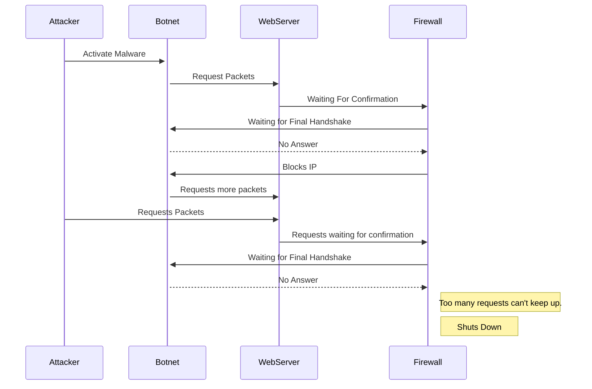

# SYN Flood Attack

## Documentation
1. The attacker infects any IoT device with malware, creating bots and with many of them creating a botnet.
2. The botnet sends many handshake requests with spoofed IP's to the webserver where the firewall tries to finalize the handshake request.
3. Firewall then recognizes faulty IP addresses and blocks the requests.
4. Botnet and Attacker repeatedly send more requests, overwhelming the firewall and causing the webserver to shut down. 
